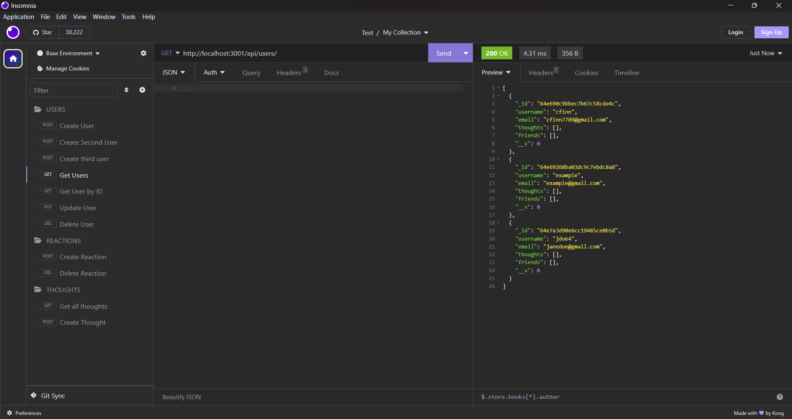

# Social Network API

  ## Description
  A social network API for storing users, thoughts, and reactions.

  ## Demonstration (Click image to view example video)

  

  ## Table of Contents
  - [Installation](#installation)
  - [Usage](#usage)
  - [Contributing](#contributing)
  - [Tests](#tests)
  - [License](#license)
  - [Contact Info](#contact-info)

  ## Installation
  There are no installation instructions.

  ## Usage
  Run node server.js in the terminal to start the server. Use Insomnia to access the database information.

  ## Contributing
  There are no contriubtion details.

  ## Tests
  There is no testing information.

  ## License
  There is no license applicable. 

  ## Contact Info
  [My Github](https://github.com/cfinn7789)
  My Email: cfinn7789@gmail.com
